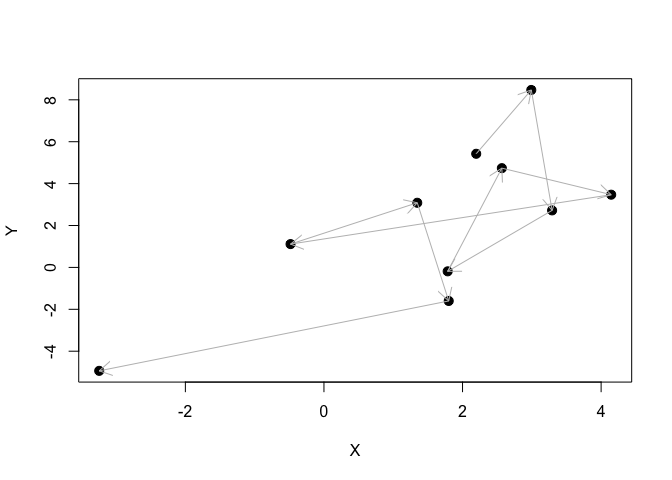
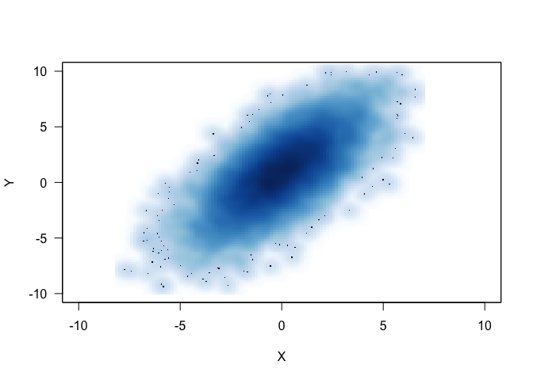

# Gibbs sampler for bivariate normal
Chris Hamm  
`r Sys.Date()`  


A bivariate normal distribution for variables $X$ and $Y$

The joint distribution is:

$$
\begin{bmatrix}
X\\Y 
\end{bmatrix}
\sim 
\left ( \begin{bmatrix}
\mu _{X}\\\mu_{Y}
\end{bmatrix} ,
\begin{bmatrix}
\sigma _{X}^{2} & \rho \sigma _{X} \sigma _{Y} \\
\rho \sigma _{X} \sigma _{Y} & \sigma _{Y}^{2} \\
\end{bmatrix}
\right)
$$

With the conditional distributions:

* for *x*:
$$
Y|X = x \sim N\left (\mu _{Y} + \frac{\sigma _{Y}}{\sigma _{X}} \rho (x - \mu _{X}), (1 - \rho ^{2}) \sigma _{Y}^{2} \right )
$$

* for *y*:
$$
X|Y = y \sim N\left (\mu _{X} + \frac{\sigma _{X}}{\sigma _{Y}} \rho (y - \mu_{Y}), (1 - \rho ^{2}) \sigma _{X}^{2} \right )
$$

# Gibbs sampling from a bivariate normal
# Original code from Xie 2014

```r
set.seed(78632)

rbinormal <- function(n, mu1, mu2, sigma1, sigma2, rho){
	# Initialize vectors
	x <- rnorm(1, mu1, sigma1)
	y <- rnorm(1, mu2, sigma2)
	xy <- matrix(nrow = n, ncol = 2, dimnames = list(NULL, c("X", "Y")))
	# Sample from conditional distributions
	for(i in 1:n){
		x <- rnorm(1, mu1 + (sigma1 / sigma2) * (rho * (y - mu2)), (sqrt(1 - rho^2) * sigma1))
		y <- rnorm(1, mu2 + (sigma2 / sigma1) * (rho * (x - mu1)), (sqrt(1 - rho^2) * sigma2))
		xy[i, ] <- c(x, y)
	}
	xy
}
```

Examples for 10 samples:

```r
n1 <- 10
z <- rbinormal(n = n1, mu1 = 0, mu2 = 1, sigma1 = 2, sigma2 = 3, rho = 0.7)
plot(y = z[, 2], x = z[, 1], pch = 19, xlab = "X", ylab = "Y", cex = 1.25)
arrows(z[-n1, 1], z[-n1, 2], z[-1, 1], z[-1, 2], length = 0.15, col = "grey")
```

<!-- -->

Example with 10,000 samples:

```r
z1 <- rbinormal(n = 10000, mu1 = 0, mu2 = 1, sigma1 = 2, sigma2 = 3, rho = 0.7)
smoothScatter(z1, nbin = 100, las = 1, xlim = c(-10, 10), ylim = c(-10, 10))
```

<!-- -->

* Initial idea and formulas from Xie 2014. 
